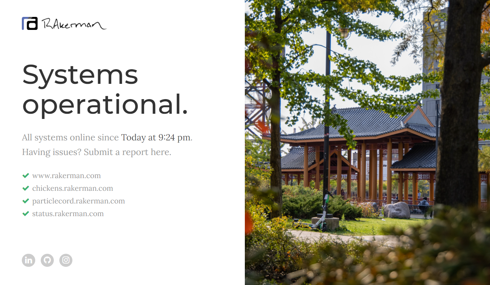

# RAkerman Fallback

A fallback web server and status monitor for rakerman.com



### Basic Structure
This project is intended to serve as a fallback web server and status monitor for any site hosted under the rakerman.com domain.
If any service suddenly becomes disconnected, this web server will handle any redirected traffic.
RAkerman Fallback also hosts status.rakerman.com, which displays the status of all related sites.
And oh yeah, whenever a service comes offline it triggers a Discord bot to send a message to any channel of your choosing.
Pretty cool right?

## Install and Setup
*Please note that this project will require a lot of customization to get running for your own purposes. 
A large portion of the logic is hard-coded.*
- Clone the repository from https://github.com
```
git clone https://github.com/RAK3RMAN/rakerman-fallback.git
```
- Setup RAkerman Fallback
    - Enter the rakerman-fallback folder
        - `cd rakerman-fallback`
    - Install all required packages with root-level access (if needed)
        - `sudo npm install`    
    - Start default application using npm
        - `npm start`
    - If you want a different broadcast port, you can configure these values by proceeding with the:
        - Hardcode option:
            - Enter the `config.json` file
                - `sudo rakerman-fallback/config/config.json`
            - Edit the `webserver_port` parameter to your desired configuration
    - If any errors occur, please read the logs and attempt to resolve. If resolution cannot be achieved, post in the issues under this project. 
- Access web application through `localhost:3000`
